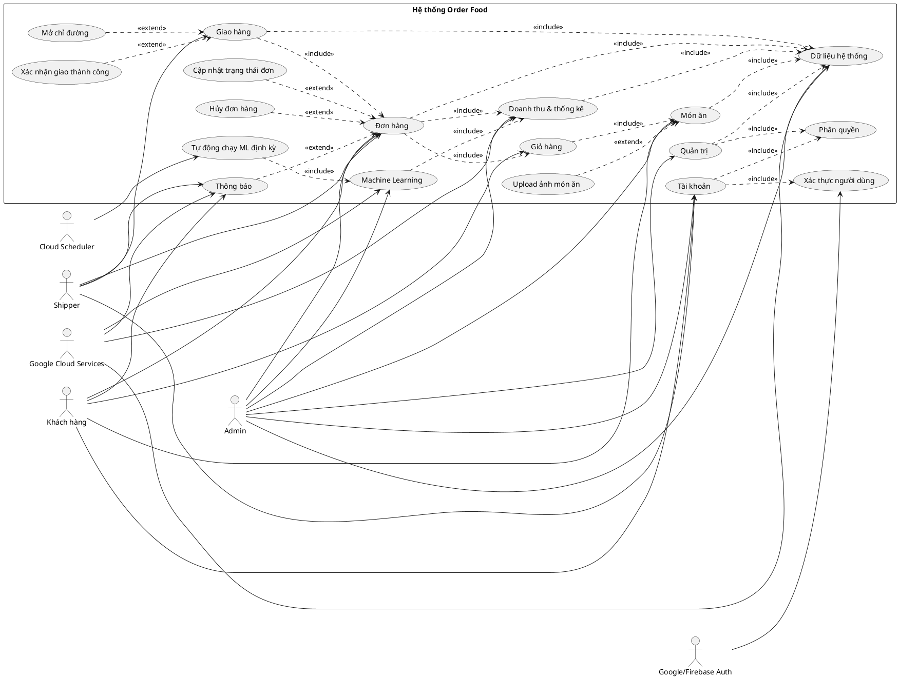

# BÁO CÁO ĐỒ ÁN

## XÂY DỰNG HỆ THỐNG ORDER FOOD TRÊN NỀN TẢNG CLOUD

**Tên đề tài:** Xây dựng hệ thống đặt món ăn trực tuyến Order Food tích hợp quản trị, giao hàng, phân tích dữ liệu và Machine Learning trên Google Cloud.

**Công nghệ chính:** Flutter Web, NodeJS/Express, Docker, Firebase Hosting, Google Cloud Run, Datastore/Firestore, Cloud Storage, BigQuery, Cloud Scheduler, Pub/Sub, Firebase Cloud Messaging, Google Maps Platform, Google Secret Manager, Python Machine Learning.

---

# MỤC LỤC

1. Giới thiệu đề tài  
2. Mục tiêu và phạm vi hệ thống  
3. Cơ sở lý thuyết và công nghệ sử dụng  
4. Phân tích yêu cầu hệ thống  
5. Thiết kế hệ thống  
6. Thiết kế cơ sở dữ liệu  
7. Thiết kế API backend  
8. Các chức năng đã xây dựng  
9. Tích hợp dịch vụ Google Cloud  
10. Machine Learning trong hệ thống  
11. Delivery Web và Google Maps  
12. Bảo mật hệ thống  
13. Triển khai hệ thống  
14. Kiểm thử hệ thống  
15. Đánh giá kết quả  
16. Phân công công việc  
17. Kết luận và hướng phát triển  
18. Tài liệu tham khảo  

---

# CHƯƠNG 1. GIỚI THIỆU ĐỀ TÀI

## 1.1. Lý do chọn đề tài

Trong bối cảnh thương mại điện tử và dịch vụ giao đồ ăn phát triển mạnh, các hệ thống đặt món trực tuyến ngày càng trở nên phổ biến. Một hệ thống đặt món thực tế không chỉ cần giao diện cho khách hàng mà còn cần backend API, cơ sở dữ liệu, giao diện quản trị, hệ thống giao hàng, phân tích dữ liệu và khả năng triển khai trên môi trường cloud.

Vì vậy, đề tài Order Food được xây dựng nhằm mô phỏng một hệ thống đặt món ăn trực tuyến hoàn chỉnh. Hệ thống có ba vai trò chính gồm khách hàng, admin và shipper. Ngoài các chức năng nghiệp vụ cơ bản, đề tài còn tích hợp nhiều dịch vụ cloud như Cloud Run, Firebase Hosting, Datastore, BigQuery, Cloud Storage, Cloud Scheduler, Pub/Sub, FCM, Monitoring, Google Maps và Secret Manager.

## 1.2. Tên đề tài

**Xây dựng hệ thống Order Food trên nền tảng Cloud.**

## 1.3. Mô tả tổng quan

Order Food là hệ thống web/app giao đồ ăn trong phạm vi thành phố Hà Nội. Khách hàng có thể đăng ký, đăng nhập, xem món ăn, thêm món vào giỏ hàng, nhập địa chỉ giao hàng và đặt món. Admin có thể quản lý món ăn, đơn hàng, người dùng, doanh thu, dữ liệu BigQuery và kết quả Machine Learning. Shipper sử dụng Delivery Web riêng để nhận đơn, xem chi tiết đơn, mở chỉ đường và cập nhật trạng thái giao hàng.

---

# CHƯƠNG 2. MỤC TIÊU VÀ PHẠM VI HỆ THỐNG

## 2.1. Mục tiêu

Hệ thống được xây dựng với các mục tiêu:

- Xây dựng giao diện khách hàng để đặt món trực tuyến.
- Xây dựng giao diện admin để quản trị hệ thống.
- Xây dựng Delivery Web riêng cho shipper.
- Xây dựng backend API bằng NodeJS/Express.
- Lưu dữ liệu bền vững trên Datastore/Firestore.
- Upload ảnh món ăn lên Cloud Storage.
- Ghi dữ liệu phân tích đơn hàng vào BigQuery.
- Tự động hóa tác vụ Machine Learning bằng Cloud Scheduler.
- Tích hợp Google Maps để hỗ trợ giao hàng.
- Tích hợp Secret Manager để quản lý thông tin nhạy cảm.
- Triển khai frontend và backend lên cloud để truy cập qua internet.

## 2.2. Phạm vi

Hệ thống tập trung vào mô hình đặt món và giao hàng trong thành phố Hà Nội. Địa chỉ giao hàng được nhập theo cấu trúc quận, phường và số nhà/tên đường. Hệ thống chưa xử lý thanh toán trực tuyến thật, chưa tích hợp đối tác giao hàng bên thứ ba thật và chưa có phân quyền chi tiết theo từng nhân viên.

---

# CHƯƠNG 3. CƠ SỞ LÝ THUYẾT VÀ CÔNG NGHỆ SỬ DỤNG

## 3.1. Flutter Web

Flutter Web được sử dụng để xây dựng giao diện người dùng. Project có hai frontend:

- `order_food_flutter`: web dành cho khách hàng và admin.
- `orderfood_delivery`: web riêng dành cho shipper.

Flutter giúp xây dựng giao diện đa nền tảng, có thể build ra web và deploy lên Firebase Hosting.

## 3.2. NodeJS/Express

Backend được xây dựng bằng NodeJS/Express. Express đảm nhiệm việc khai báo route, xử lý request, gọi service, làm việc với database và trả dữ liệu JSON cho frontend.

## 3.3. Docker và Cloud Run

Backend được đóng gói bằng Docker để chạy trên Google Cloud Run. Cloud Run cho phép triển khai container serverless, tự động mở rộng theo request và cung cấp HTTPS mặc định.

## 3.4. Datastore/Firestore

Datastore/Firestore Datastore Mode được dùng làm database chính để lưu người dùng, món ăn, giỏ hàng, đơn hàng và dữ liệu dự đoán.

## 3.5. BigQuery

BigQuery được dùng để lưu dữ liệu phân tích dạng event. Các sự kiện như tạo đơn, hủy đơn, cập nhật trạng thái, shipper nhận đơn và giao thành công được ghi vào BigQuery để phục vụ thống kê.

## 3.6. Machine Learning

Phần Machine Learning được xây dựng bằng Python, pandas, scikit-learn và RandomForestRegressor. Mô hình dùng dữ liệu đơn hàng để dự đoán món bán chạy, doanh thu dự kiến và đề xuất nhập hàng/khuyến mãi.

## 3.7. Google Maps Platform

Google Maps được tích hợp trong Delivery Web để shipper có thể mở chỉ đường giao hàng từ vị trí hiện tại đến địa chỉ khách hàng.

## 3.8. Google Secret Manager

Secret Manager dùng để lưu thông tin nhạy cảm như Google Maps API Key, JWT Secret, Firebase Admin config, Pub/Sub topic, Cloud Storage bucket và các biến cấu hình quan trọng.

---

# CHƯƠNG 4. PHÂN TÍCH YÊU CẦU HỆ THỐNG

## 4.1. Tác nhân hệ thống

Hệ thống có các tác nhân chính:

- **Khách hàng:** người đặt món.
- **Admin:** người quản trị hệ thống.
- **Shipper:** người giao hàng.
- **Cloud Scheduler:** dịch vụ tự động gọi tác vụ định kỳ.
- **Google/Firebase Auth:** dịch vụ xác thực.
- **Google Cloud Services:** nhóm dịch vụ lưu trữ, phân tích, thông báo, bảo mật và giám sát.

## 4.2. Yêu cầu chức năng khách hàng

Khách hàng có thể:

- Đăng ký tài khoản.
- Đăng nhập bằng email/mật khẩu.
- Đăng nhập bằng Google.
- Xem danh sách món ăn.
- Tìm kiếm và lọc món ăn.
- Xem chi tiết món ăn.
- Thêm món vào giỏ hàng.
- Cập nhật số lượng món trong giỏ.
- Nhập địa chỉ giao hàng tại Hà Nội.
- Đặt món.
- Theo dõi trạng thái đơn hàng.
- Hủy đơn hàng nếu đơn chưa hoàn thành.

## 4.3. Yêu cầu chức năng admin

Admin có thể:

- Đăng nhập vào giao diện quản trị.
- Xem dashboard thống kê.
- Quản lý món ăn.
- Upload ảnh món ăn.
- Quản lý đơn hàng.
- Cập nhật trạng thái đơn hàng.
- Quản lý người dùng.
- Xem doanh thu.
- Xem món bán chạy.
- Xem dữ liệu BigQuery.
- Huấn luyện lại model Machine Learning.
- Cập nhật và xem dự đoán Machine Learning.

## 4.4. Yêu cầu chức năng shipper

Shipper có thể:

- Đăng nhập vào Delivery Web.
- Xem danh sách đơn chờ giao.
- Nhận đơn giao.
- Xem đơn giao của mình.
- Xem chi tiết đơn hàng.
- Mở Google Maps để chỉ đường.
- Cập nhật trạng thái đang giao.
- Xác nhận giao thành công.

## 4.5. Yêu cầu phi chức năng

- Hệ thống có thể truy cập qua internet.
- Backend có HTTPS mặc định.
- Dữ liệu được lưu bền vững trên cloud.
- Backend có thể tự động mở rộng.
- Không hardcode secret trong source code.
- Có log và monitoring để theo dõi hệ thống.
- Giao diện dễ sử dụng, phù hợp cho demo đồ án.

---

# CHƯƠNG 5. THIẾT KẾ HỆ THỐNG

## 5.1. Kiến trúc tổng thể

```text
-------------------------+
| Customer/Admin Web     |
| Flutter Web            |
+-----------+-------------+
            |
            | HTTPS API
            v
+-------------------------+
| Firebase Hosting        |
+-----------+-------------+
            |
            v
+-------------------------+
| Cloud Run Backend API   |
| NodeJS/Express + Python |
+-----+-----+------+------+ 
      |     |      |
      v     v      v
 Datastore BigQuery Cloud Storage
      |
      v
 Pub/Sub / FCM / Scheduler / ML

+-------------------------+
| Delivery Web            |
| Flutter Web             |
+-----------+-------------+
            |
            v
       Cloud Run API
            |
            v
       Google Maps
```

## 5.2. Cấu trúc project

```text
orderfood/
├── order_food_flutter/       # Frontend khách hàng và admin
├── orderfood_delivery/       # Frontend shipper
├── order-food-api/           # Backend NodeJS/Express
└── docs/                     # Tài liệu báo cáo
```

## 5.3. Cấu trúc backend

Backend được tổ chức theo hướng tách lớp:

```text
order-food-api/
├── server.js
├── app.js
├── routes/
├── controllers/
├── services/
├── repositories/
├── middlewares/
├── config/
├── constants/
├── utils/
├── ml/
└── scripts/
```

Trong đó:

- `routes/`: khai báo endpoint API.
- `controllers/`: nhận request và trả response.
- `services/`: xử lý logic nghiệp vụ.
- `repositories/`: làm việc trực tiếp với database.
- `config/`: cấu hình Google Cloud services.
- `middlewares/`: xử lý auth, admin, upload, lỗi.
- `ml/`: chứa file Python Machine Learning.

## 5.4. Cấu trúc frontend

Frontend chính được tổ chức theo hướng:

```text
order_food_flutter/lib/
├── main.dart
├── app.dart
├── core/
├── models/
├── services/
├── providers/
├── screens/
├── widgets/
└── routes/
```

Trong đó:

- `screens/`: chứa các màn hình chính.
- `widgets/`: chứa component tái sử dụng.
- `services/`: gọi API backend.
- `models/`: định nghĩa class dữ liệu.
- `core/`: chứa constants, config và utils.

---

# CHƯƠNG 6. USE CASE HỆ THỐNG

## 6.1. Use case tổng quát



## 6.2. Use case admin

Admin tương tác với các phân hệ quản trị, món ăn, đơn hàng, người dùng, doanh thu, BigQuery và Machine Learning.

## 6.3. Use case khách hàng

Khách hàng tương tác với phân hệ tài khoản, món ăn, giỏ hàng, đơn hàng và theo dõi trạng thái đơn.

## 6.4. Use case shipper

Shipper tương tác với phân hệ giao hàng, đơn hàng, Google Maps và trạng thái giao hàng.

---

# CHƯƠNG 7. THIẾT KẾ CƠ SỞ DỮ LIỆU

## 7.1. Các thực thể chính

Hệ thống sử dụng Datastore/Firestore Datastore Mode với các nhóm dữ liệu chính:

### User

Lưu thông tin người dùng:

```json
{
  "id": "U0001",
  "name": "Demo User",
  "email": "demo@orderfood.local",
  "password": "...",
  "provider": "email",
  "role": "customer",
  "avatar": ""
}
```

### Food

Lưu thông tin món ăn:

```json
{
  "id": 1,
  "name": "Burger bò phô mai",
  "price": 50000,
  "originalPrice": 65000,
  "image": "https://...",
  "category": "Burger",
  "restaurant": "Burger House",
  "rating": 4.8,
  "sold": 210,
  "active": true
}
```

### Cart

Lưu giỏ hàng theo người dùng:

```json
{
  "userId": "huy123@gmail.com",
  "items": [
    {
      "foodId": 1,
      "quantity": 2
    }
  ]
}
```

### Order

Lưu thông tin đơn hàng:

```json
{
  "id": "OD12345678",
  "userId": "huy123@gmail.com",
  "userEmail": "huy123@gmail.com",
  "items": [],
  "subtotal": 100000,
  "shippingFee": 15000,
  "voucherDiscount": 0,
  "total": 115000,
  "address": "1002 Đường Giải Phóng, Giáp Bát, Hoàng Mai, Hà Nội",
  "street": "1002 Đường Giải Phóng",
  "ward": "Giáp Bát",
  "district": "Hoàng Mai",
  "city": "Hà Nội",
  "status": "pending",
  "createdAt": "2026-06-15T10:00:00.000Z",
  "updatedAt": "2026-06-15T10:00:00.000Z"
}
```

## 7.2. Trạng thái đơn hàng

Các trạng thái đơn hàng:

| Mã trạng thái | Ý nghĩa |
|---|---|
| `pending` | Chờ xác nhận |
| `confirmed` | Đã xác nhận |
| `preparing` | Đang chuẩn bị |
| `waiting_shipper` | Chờ shipper lấy hàng |
| `assigned_shipper` | Shipper đã nhận đơn |
| `delivering` | Đang giao |
| `completed` | Giao thành công |
| `cancelled` | Đã hủy |

---

# CHƯƠNG 8. THIẾT KẾ API BACKEND

## 8.1. Auth API

| Method | Endpoint | Chức năng |
|---|---|---|
| POST | `/auth/register` | Đăng ký tài khoản |
| POST | `/auth/login` | Đăng nhập email/mật khẩu |
| POST | `/auth/google` | Đăng nhập Google |
| POST | `/auth/google-login` | Đồng bộ đăng nhập Google |
| GET | `/auth/me` | Lấy thông tin người dùng hiện tại |

## 8.2. Food API

| Method | Endpoint | Chức năng |
|---|---|---|
| GET | `/foods` | Lấy danh sách món ăn |
| GET | `/foods/search` | Tìm kiếm món ăn |
| GET | `/foods/:id` | Xem chi tiết món ăn |

## 8.3. Cart API

| Method | Endpoint | Chức năng |
|---|---|---|
| GET | `/cart` | Lấy giỏ hàng theo query userId |
| PUT | `/cart` | Đồng bộ giỏ hàng |
| GET | `/cart/:userId` | Lấy giỏ hàng theo userId |
| POST | `/cart/:userId/items` | Thêm món vào giỏ |
| PATCH | `/cart/:userId/items/:foodId` | Cập nhật món trong giỏ |
| DELETE | `/cart/:userId/items/:foodId` | Xóa món khỏi giỏ |
| DELETE | `/cart/:userId` | Xóa toàn bộ giỏ |

## 8.4. Order API

| Method | Endpoint | Chức năng |
|---|---|---|
| GET | `/orders` | Lấy danh sách đơn |
| POST | `/orders` | Tạo đơn hàng |
| GET | `/orders/detail/:orderId` | Xem chi tiết đơn |
| GET | `/orders/:userId` | Lấy đơn theo người dùng |
| PATCH | `/orders/:id/cancel` | Hủy đơn hàng |
| DELETE | `/orders/:id` | Xóa thông tin đơn |

## 8.5. Admin API

| Method | Endpoint | Chức năng |
|---|---|---|
| GET | `/admin/dashboard` | Lấy dữ liệu dashboard |
| GET | `/admin/users` | Lấy danh sách người dùng |
| DELETE | `/admin/users/:userId` | Xóa tài khoản khách |
| GET | `/admin/foods` | Lấy danh sách món cho admin |
| POST | `/admin/foods` | Thêm món ăn |
| PATCH | `/admin/foods/:id` | Sửa món ăn |
| DELETE | `/admin/foods/:id` | Ẩn/xóa món ăn |
| GET | `/admin/orders` | Lấy danh sách đơn hàng |
| PATCH | `/admin/orders/:id/status` | Cập nhật trạng thái đơn |
| GET | `/admin/revenue` | Xem doanh thu |
| GET | `/admin/best-selling-foods` | Xem món bán chạy |
| GET | `/admin/suggestions` | Xem đề xuất kinh doanh |

## 8.6. Shipper API

| Method | Endpoint | Chức năng |
|---|---|---|
| GET | `/shipper/orders/available` | Lấy đơn chờ giao |
| GET | `/shipper/orders/my-orders/:shipperId` | Lấy đơn của shipper |
| GET | `/shipper/orders/detail/:orderId` | Xem chi tiết đơn giao |
| PATCH | `/shipper/orders/:orderId/accept` | Nhận đơn |
| PATCH | `/shipper/orders/:orderId/delivering` | Cập nhật đang giao |
| PATCH | `/shipper/orders/:orderId/completed` | Xác nhận giao thành công |

## 8.7. BigQuery API

| Method | Endpoint | Chức năng |
|---|---|---|
| GET | `/admin/bigquery-events` | Admin xem event BigQuery |
| GET | `/bigquery/order-events` | Lấy event đơn hàng |
| POST | `/bigquery/order-events` | Ghi event đơn hàng |
| GET | `/bigquery/revenue-summary` | Thống kê doanh thu |
| GET | `/bigquery/best-selling-foods` | Thống kê món bán chạy |

## 8.8. Machine Learning API

| Method | Endpoint | Chức năng |
|---|---|---|
| GET | `/admin/ml-predictions` | Lấy kết quả dự đoán ML |
| POST | `/admin/train-ml-model` | Huấn luyện lại model |
| POST | `/admin/update-ml-predictions` | Cập nhật dự đoán ML |
| POST | `/ml/train` | API ML train |
| POST | `/ml/predict` | API ML predict |
| GET | `/ml/predictions` | Lấy dự đoán ML |

## 8.9. Upload API

| Method | Endpoint | Chức năng |
|---|---|---|
| POST | `/admin/foods/upload-image` | Upload ảnh món ăn cho admin |
| POST | `/upload/food-image` | Upload ảnh món ăn |

## 8.10. Notification API

| Method | Endpoint | Chức năng |
|---|---|---|
| POST | `/notifications/save-token` | Lưu FCM token |

## 8.11. Maps API

| Method | Endpoint | Chức năng |
|---|---|---|
| GET/POST | Maps endpoint | Hỗ trợ geocoding/chỉ đường nếu có cấu hình |

---

# CHƯƠNG 9. CÁC CHỨC NĂNG ĐÃ XÂY DỰNG

## 9.1. Chức năng khách hàng

Frontend khách hàng cho phép người dùng đăng ký, đăng nhập, đăng nhập Google, xem danh sách món ăn, xem chi tiết món ăn, thêm món vào giỏ hàng, cập nhật giỏ hàng, nhập địa chỉ giao hàng theo quận/phường Hà Nội, đặt món và theo dõi trạng thái đơn.

## 9.2. Chức năng admin

Giao diện admin có các tab:

- Dashboard.
- Món ăn.
- Đơn hàng.
- Người dùng.
- Doanh thu.
- Bán chạy.
- Đề xuất.
- BigQuery.

Admin có thể quản lý món ăn, upload ảnh, quản lý đơn hàng, cập nhật trạng thái, xóa tài khoản khách, xem thống kê và dùng Machine Learning.

## 9.3. Chức năng shipper

Delivery Web cho phép shipper đăng nhập, xem đơn chờ giao, nhận đơn, xem đơn của mình, xem chi tiết đơn, mở chỉ đường xe máy và cập nhật trạng thái giao hàng.

---

# CHƯƠNG 10. TÍCH HỢP DỊCH VỤ GOOGLE CLOUD

## 10.1. Google Cloud Run

Cloud Run được dùng để triển khai backend API. Backend được đóng gói bằng Docker image, lưu trên Artifact Registry và deploy lên Cloud Run.

Ưu điểm:

- Không cần tự quản lý server.
- Có HTTPS mặc định.
- Tự động mở rộng theo request.
- Phù hợp với backend NodeJS kết hợp Python Machine Learning.

## 10.2. Firebase Hosting

Firebase Hosting được dùng để deploy:

- Web khách hàng/admin.
- Delivery Web.

Các web có thể truy cập bằng Firebase domain và custom domain.

## 10.3. Firebase Authentication

Firebase Authentication hỗ trợ đăng nhập Google. Sau khi đăng nhập thành công, frontend gửi thông tin user về backend để đồng bộ dữ liệu và xác định role.

## 10.4. Datastore/Firestore

Datastore/Firestore dùng để lưu dữ liệu nghiệp vụ chính, giúp dữ liệu đồng bộ giữa nhiều thiết bị.

## 10.5. Cloud Storage

Cloud Storage dùng để lưu ảnh món ăn do admin upload. Backend trả về URL ảnh để frontend hiển thị.

## 10.6. BigQuery

BigQuery lưu event phục vụ phân tích:

- Số đơn.
- Doanh thu.
- Trạng thái đơn.
- Hoạt động của shipper.
- Dữ liệu phục vụ báo cáo.

## 10.7. Cloud Scheduler

Cloud Scheduler dùng để gọi API Machine Learning theo lịch, giúp cập nhật dự đoán định kỳ mà không cần admin thao tác thủ công.

## 10.8. Pub/Sub

Pub/Sub dùng để publish các sự kiện đơn hàng. Cơ chế này giúp hệ thống dễ mở rộng thêm các tác vụ bất đồng bộ như gửi thông báo, ghi phân tích hoặc cập nhật ML.

## 10.9. Firebase Cloud Messaging

FCM dùng để gửi thông báo khi có sự kiện như cập nhật trạng thái đơn hàng.

## 10.10. Cloud Monitoring và Logging

Cloud Monitoring và Cloud Logging dùng để theo dõi backend Cloud Run:

- Request count.
- Latency.
- Lỗi 4xx/5xx.
- Log backend.
- Revision Cloud Run.
- Instance count.

## 10.11. Google Maps Platform

Google Maps hỗ trợ shipper mở chỉ đường giao hàng bằng xe máy từ vị trí hiện tại tới điểm giao.

## 10.12. Secret Manager

Secret Manager quản lý các thông tin nhạy cảm:

- Google Maps API Key.
- Firebase Admin Config.
- JWT Secret.
- FCM Server Key.
- Pub/Sub Topic.
- Cloud Storage Bucket.
- Admin Emails.
- ML Secret Key.

---

# CHƯƠNG 11. MACHINE LEARNING TRONG HỆ THỐNG

## 11.1. Mục tiêu ML

Machine Learning được bổ sung để hỗ trợ admin ra quyết định kinh doanh:

- Dự đoán món bán chạy.
- Dự đoán doanh thu ngày mai.
- Dự đoán doanh thu 7 ngày tới.
- Đề xuất nhập thêm nguyên liệu.
- Đề xuất khuyến mãi.

## 11.2. Dữ liệu huấn luyện

Dữ liệu gồm các trường:

- `orderId`
- `userId`
- `foodName`
- `category`
- `price`
- `quantity`
- `dayOfWeek`
- `hour`
- `isWeekend`
- `totalAmount`

## 11.3. Mô hình sử dụng

Hệ thống sử dụng `RandomForestRegressor` trong scikit-learn.

Có hai model:

- `model_food.pkl`: dự đoán số lượng bán.
- `model_revenue.pkl`: dự đoán doanh thu.

## 11.4. Luồng xử lý ML

```text
Dữ liệu đơn hàng
-> Export dữ liệu runtime
-> train_model.py
-> model_food.pkl / model_revenue.pkl
-> predict.py
-> predictions.json
-> Backend API
-> Admin Dashboard
```

## 11.5. Kết quả dự đoán

Kết quả ML gồm:

- Danh sách món bán chạy dự kiến.
- Doanh thu ngày mai.
- Doanh thu 7 ngày tới.
- Đề xuất nhập hàng.
- Đề xuất khuyến mãi.

---

# CHƯƠNG 12. DELIVERY WEB VÀ GOOGLE MAPS

## 12.1. Mục tiêu Delivery Web

Delivery Web được xây dựng riêng cho shipper nhằm tách luồng giao hàng khỏi giao diện khách hàng/admin.

## 12.2. Luồng giao hàng

```text
Khách đặt món
-> Admin xác nhận
-> Admin chuẩn bị
-> Chờ shipper lấy hàng
-> Shipper nhận đơn
-> Shipper đang giao
-> Shipper giao thành công
```

## 12.3. Google Maps

Trong chi tiết đơn giao, shipper có thể bấm nút mở Google Maps. Hệ thống ưu tiên mở chỉ đường bằng xe máy từ vị trí hiện tại của shipper tới địa chỉ khách hàng.

Nếu chưa có Google Maps API Key, hệ thống vẫn hiển thị địa chỉ text và nút mở Google Maps bên ngoài.

---

# CHƯƠNG 13. BẢO MẬT HỆ THỐNG

## 13.1. Phân quyền

Hệ thống có các role:

- `customer`
- `admin`
- `shipper`

Backend kiểm tra email và role để điều hướng người dùng tới đúng giao diện.

## 13.2. Secret Manager

Các secret không nên hardcode trong code hoặc commit lên GitHub. Secret Manager giúp lưu trữ secret an toàn hơn và phù hợp với môi trường Cloud Run.

## 13.3. IAM

IAM được dùng để cấp quyền cho service account của Cloud Run truy cập Datastore, BigQuery, Storage, Pub/Sub và Secret Manager.

---

# CHƯƠNG 14. TRIỂN KHAI HỆ THỐNG

## 14.1. Triển khai backend

```powershell
cd D:\Cloud\orderfood\order-food-api

$PROJECT_ID="flutter-orderfood-497814"
$REGION="asia-southeast1"
$REPO="orderfood-repo"
$SERVICE="order-food-api"
$IMAGE="$REGION-docker.pkg.dev/$PROJECT_ID/$REPO/${SERVICE}:latest"

gcloud config set project $PROJECT_ID
npm install
node --check server.js
gcloud builds submit --tag $IMAGE

gcloud run deploy $SERVICE `
  --image $IMAGE `
  --region $REGION `
  --allow-unauthenticated `
  --memory 1Gi `
  --cpu 1 `
  --timeout 300 `
  --max-instances 5
```

## 14.2. Triển khai frontend chính

```powershell
cd D:\Cloud\orderfood\order_food_flutter

flutter analyze
flutter build web --dart-define=API_URL=https://order-food-api-294162583218.asia-southeast1.run.app
firebase deploy --only hosting
```

## 14.3. Triển khai Delivery Web

```powershell
cd D:\Cloud\orderfood\orderfood_delivery

flutter analyze
flutter build web `
  --dart-define=API_URL=https://order-food-api-294162583218.asia-southeast1.run.app `
  --dart-define=GOOGLE_MAPS_API_KEY=YOUR_GOOGLE_MAPS_API_KEY

firebase deploy --only hosting:delivery
```

---

# CHƯƠNG 15. KIỂM THỬ HỆ THỐNG

## 15.1. Kiểm thử backend

Các API được kiểm thử bằng PowerShell:

```powershell
$API="https://order-food-api-294162583218.asia-southeast1.run.app"

Invoke-WebRequest "$API/health" -UseBasicParsing
Invoke-WebRequest "$API/foods" -UseBasicParsing
Invoke-WebRequest "$API/admin/ml-predictions" -UseBasicParsing
```

## 15.2. Kiểm thử frontend

Kiểm thử các luồng:

- Đăng ký.
- Đăng nhập.
- Đăng nhập Google.
- Xem món ăn.
- Thêm giỏ hàng.
- Đặt món.
- Theo dõi đơn hàng.
- Admin cập nhật trạng thái.
- Shipper nhận đơn và hoàn thành đơn.

## 15.3. Kiểm thử cloud

Kiểm thử:

- Cloud Run logs.
- BigQuery query.
- Pub/Sub publish/pull.
- Firebase Hosting deployment.
- Cloud Scheduler job.
- Secret Manager access.
- Cloud Monitoring metrics.

---

# CHƯƠNG 16. ĐÁNH GIÁ KẾT QUẢ

## 16.1. Kết quả đạt được

Hệ thống đã đạt được:

- Có web khách hàng/admin.
- Có Delivery Web riêng cho shipper.
- Backend chạy public trên Cloud Run.
- Frontend deploy bằng Firebase Hosting.
- Dữ liệu lưu trên Datastore/Firestore.
- Ảnh món ăn lưu trên Cloud Storage.
- Event đơn hàng ghi vào BigQuery.
- Có Machine Learning dự đoán doanh thu và món bán chạy.
- Có Cloud Scheduler tự động gọi ML.
- Có Pub/Sub và FCM cho hướng mở rộng thông báo.
- Có Monitoring/Logging để theo dõi hệ thống.
- Có Secret Manager để quản lý secret.

## 16.2. Hạn chế

Một số hạn chế hiện tại:

- Chưa có thanh toán online thật.
- Chưa có đối tác giao hàng thật.
- Machine Learning còn đơn giản, phù hợp demo.
- Chưa có hệ thống phân quyền chi tiết theo từng chức năng.
- Bản đồ trực tiếp phụ thuộc Google Maps API Key và billing.

---

# CHƯƠNG 17. PHÂN CÔNG CÔNG VIỆC

## Thành viên 1: Cloud Deployment, Google Cloud, BigQuery, Scheduler, ML và báo cáo

- Deploy backend lên Cloud Run.
- Cấu hình Firebase Hosting.
- Tích hợp BigQuery.
- Tích hợp Cloud Scheduler.
- Xây dựng Machine Learning.
- Tích hợp Secret Manager.
- Viết báo cáo tổng hợp.

## Thành viên 2: Frontend khách hàng

- Xây dựng giao diện khách hàng.
- Xây dựng danh sách món ăn.
- Xây dựng giỏ hàng.
- Xây dựng checkout.
- Xây dựng theo dõi đơn hàng.

## Thành viên 3: Backend API

- Xây dựng API auth.
- Xây dựng API food.
- Xây dựng API cart.
- Xây dựng API order.
- Xây dựng API admin.
- Refactor backend theo routes/controllers/services/repositories.

## Thành viên 4: Database và lưu trữ

- Thiết kế dữ liệu User, Food, Cart, Order.
- Kết nối Datastore/Firestore.
- Tích hợp Cloud Storage upload ảnh.
- Kiểm tra đồng bộ dữ liệu giữa nhiều thiết bị.

## Thành viên 5: Giao diện admin và Delivery

- Xây dựng giao diện admin.
- Xây dựng dashboard.
- Quản lý món, đơn, user.
- Xây dựng Delivery Web cho shipper.
- Tích hợp Google Maps cho giao hàng.

---

# CHƯƠNG 18. KẾT LUẬN VÀ HƯỚNG PHÁT TRIỂN

## 18.1. Kết luận

Đề tài Order Food Cloud System đã xây dựng được một hệ thống đặt món ăn tương đối hoàn chỉnh, có đầy đủ ba vai trò khách hàng, admin và shipper. Hệ thống không chỉ có các chức năng CRUD cơ bản mà còn tích hợp nhiều dịch vụ cloud phục vụ triển khai, lưu trữ, phân tích, bảo mật, giám sát và tự động hóa.

Thông qua đề tài, nhóm đã hiểu rõ hơn cách xây dựng một hệ thống cloud thực tế, cách frontend gọi backend public API, cách lưu dữ liệu trên cloud, cách deploy bằng Cloud Run và Firebase Hosting, cách sử dụng BigQuery cho phân tích dữ liệu và cách tích hợp Machine Learning vào dashboard quản trị.

## 18.2. Hướng phát triển

Trong tương lai, hệ thống có thể phát triển thêm:

- Thanh toán online bằng ví điện tử hoặc thẻ ngân hàng.
- Tích hợp đối tác giao hàng bên thứ ba.
- Xây dựng mobile app native.
- Cải thiện Machine Learning bằng dữ liệu thật lớn hơn.
- Tối ưu bảo mật bằng xác thực JWT đầy đủ.
- Bổ sung phân quyền chi tiết cho admin.
- Xây dựng dashboard phân tích nâng cao.
- Tích hợp CI/CD tự động khi push code lên GitHub.

---

# TÀI LIỆU THAM KHẢO

1. Google Cloud Run Documentation.  
2. Firebase Hosting Documentation.  
3. Firebase Authentication Documentation.  
4. Google Cloud Datastore / Firestore Documentation.  
5. Google BigQuery Documentation.  
6. Google Cloud Storage Documentation.  
7. Google Cloud Scheduler Documentation.  
8. Google Cloud Pub/Sub Documentation.  
9. Firebase Cloud Messaging Documentation.  
10. Google Secret Manager Documentation.  
11. Flutter Documentation.  
12. NodeJS / Express Documentation.  
13. scikit-learn Documentation.  

